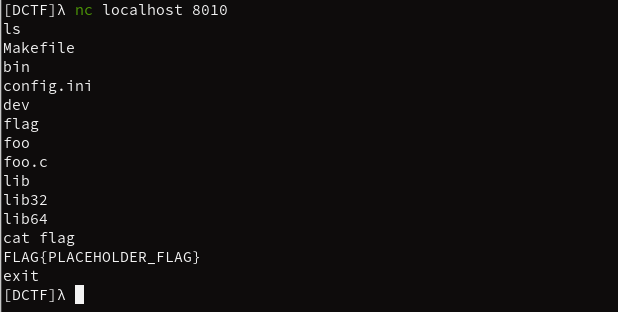
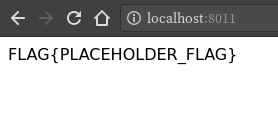

# DCTF

DCTF is a Docker-based CTF platform that is used to deploy (currently) binary and web(flask) challenges in a docker container.

## Dependencies

* python>=3.5
* pip
	* docker
	* docker-compose
	* ruamel.yaml

> **Note:**
> To satisfy all pip dependencies run `sudo pip install -r requirements.txt`.

## Quick Setup

Quickly building and bringing the CTF up is as simple as running a single command.

`python ctf.py -bus`

This builds the docker images, brings the CTF up using the newly generated `docker-compose.yml` file, and prints the status of the challenges. More information on this below.

Connecting to `localhost:8010` with netcat, we can see that our binary is being served within the docker container on the specified port.



Navigating to `localhost:8011` with our browser, we can see that our flask app is running perfectly.



## Usage

```
usage: ctf.py [-h] [-b] [-u | -d] [-f] [-s] [-r] [--platform PLATFORM]
              [--update]

Docker-based CTF Platform

optional arguments:
  -h, --help           show this help message and exit
  -b, --build          build the docker images
  -u, --up             start the CTF
  -d, --down           stop the CTF
  -f, --fly            deploy new challenges on the fly
  -s, --status         displays the status of the challenges
  -r, --remove         remove all ctf containers and images
  --platform PLATFORM  install ctf frontend [CTFd/FBCTF]
  --update             update the docker compose config
```

### Build

The `build` flag parses the YAML files that are paired with every challenge and runs the `./scripts/gen.sh` script with the proper arguments according to the type of the challenge.

After the `gen.sh` script finishes, `build` calls the `build` script in the `skel` directory which builds the appropriate docker image.

### Up

The `up` flag calls the `update` function to get an up to date list of all of the challenges and then calls `docker-compose up -d` to start the challenges in the background.

### Down

The `down` flag calls `docker-compose down`.

### Fly

The `fly` flag calls `build`, then `update`, and then `docker-compose up -d`. This is a quick and dirty solution without having to mess with figuring out what is up and what isn't.

### Status

The `status` flag calls `docker-compose ps`.

### Remove

The `remove` flag parses the INI files that are paired with every challenge and runs the `./scripts/delete.sh` script with the name of each challenge in order to delete all challenge-related containers and images.

Once all containers and images are removed, `remove` calls `./scripts/remove.sh` which removes all directories matching `*-build` in the main directory. After removing all build directories, it calls `docker network prune -f` to forcibly remove unused docker networks.

### Platform

The `platform` flag currently allows you to generate config files for FBCTF. Future plans will be to allow for CTFd and NIZKCTF.

### Update

The `update` flag has no short option. It is used as a manual way of updating the `docker-compose.yml` file. It parses all YAML files in the challenge directories and builds the `docker-compose.yml` file based on the name of the challenge and the ports it runs on.

## config.yml

The `config.yml` file is a very important file. It is necessary to include one in every challenge folder. Without this, the platform doesn't know what to call your challenge or what port it runs on. The use of the `config.yml` file was to give the naming conventions of challenges as much leeway as possible.

Below is the sample `config.yml` file for `foo-bin`:

```
1. Foo Bin Challenge:
2.   title: foo
3.   description: Binary challenge example.
4.   category: pwnable
5.   flag: FLAG{PLACEHOLDER_FLAG}
6.   points: 10
7.   port: 8010
8.   serve: true
9.   hint: ""
```

### Challenge Title - Line 1

The challenge title can be anything. This is to help identify the challenge to the author.

### Title - Line 2

The title of the challenge must be within `[A-Za-z0-9._-]`. This is a requirement per the Docker specification. Docker image names may not stray from this.<sup>[1]</sup>

> **Note:**
> If there is a binary being served, it **must** be the same name.

### Description - Line 3

The description can be anything. It is only used when generating FBCTF config files.<sup>[1]</sup>

### Category - Line 4

The type of challenge is required. There is one special challenge category that is `web`. If the category of the challenge is `web`, then the platform will look for a file called `app.py` in the root of the challenge folder. This is used to serve a Flask website. Everything else (`binary`, `crypto`, `re`, etc.) will be treated as a binary challenge.<sup>[1]</sup>

### Flag - Line 5

The flag is not required, but it is used to help easily identify the flag of the challenge.<sup>[1]</sup>

### Points - Line 6

The points are not required, but it is used as a reference.<sup>[1]</sup>

### Port - Line 7

The port number is required **if you have serve set to true**. This is the local port that your challenge will be served on.<sup>[1]</sup>

### Serve - Line 8

Serve can either be 'true' or 'false'. This depends on whether or not you want the challenge to be run by Docker. This can be used to create multiple challenges under the same Docker container.

### Hint - Line 9

The hint is required if you want to generate valid FBCTF configs. If your challenge does not need a hint, simply put two quotation marks.<sup>[1]</sup>

<sup>**[1]**</sup> If you want to generate an FBCTF config file with `--platform`, this is **required**.

### Barebones `config.yml`

The most barebones `config.yml` would be as follows:

```
Foo Bin Challenge:
  title: foo
  category: pwnable
  port: 8010
  serve: true
```

> **Note:**
> This is not compliant with FBCTF as it does not have a hint field, however the DCTF platform will be able to handle the creation of a docker container to serve this challenge.
